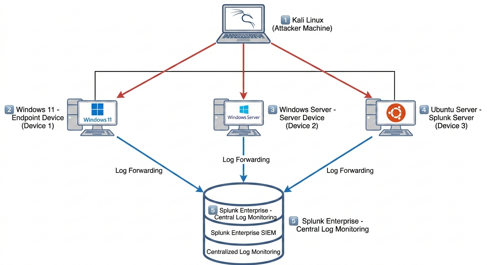
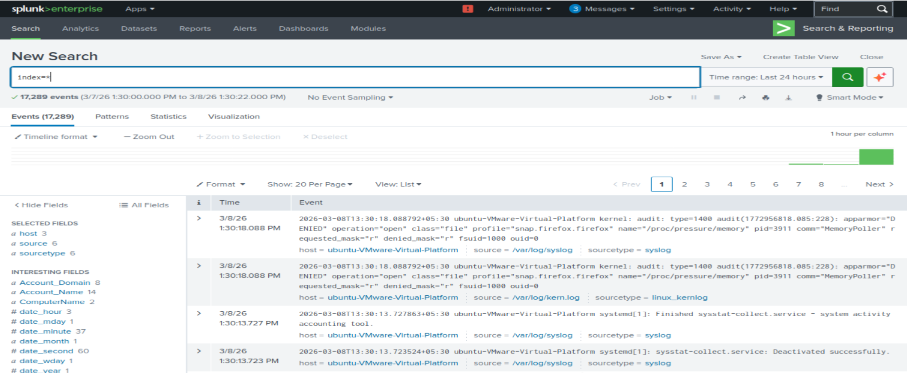
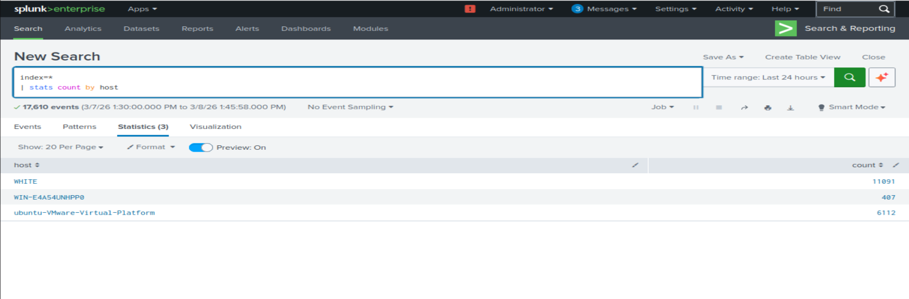

# SOC Mini Homelab Project

## Overview
This project demonstrates a practical **Security Operations Center (SOC) mini lab** where multiple systems send security logs to a centralized **Splunk SIEM server** for monitoring and analysis.

The goal of this lab is to understand how SOC teams collect logs from different machines and analyze them in a SIEM platform to monitor security events and detect suspicious activities.

---

# Lab Environment

The SOC lab consists of four systems connected within the same network.

### Attacker Machine
**Operating System:** Kali Linux  

**Purpose:**  
Used to simulate attacker activities and generate security events within the lab environment.

---

### Device 1 – Endpoint System
**Operating System:** Windows 11  

**Role:** Endpoint machine sending logs to Splunk

**Configuration**
- Splunk Universal Forwarder installed
- Windows Event Logs forwarded to the SIEM server

---

### Device 2 – Server System
**Operating System:** Windows Server  

**Role:** Server machine sending logs to Splunk

**Configuration**
- Splunk Universal Forwarder installed
- System and Security logs forwarded to Splunk

---

### Device 3 – SIEM Server
**Operating System:** Ubuntu Server  

**Role:** Centralized logging and monitoring system

**Configuration**
- Splunk Enterprise installed
- Receives logs from Windows 11 and Windows Server
- Used for log analysis and monitoring

---

## Architecture

    
 
---

# Architecture Explanation

The SOC lab consists of multiple machines connected within the same network.

### Attacker Machine
- Kali Linux is used to simulate attacker activity.

### Endpoint Devices
- Windows 11  
- Windows Server  
- Ubuntu Server  

These systems generate system and security logs.

### Log Collection
Each device forwards logs using **Splunk Universal Forwarder** to the **Splunk Enterprise server**.

### SIEM Server
Splunk Enterprise collects and centralizes logs from all machines for monitoring and analysis.

---

# Tools Used

- **Splunk Enterprise** – SIEM platform used for centralized log monitoring and analysis  
- **Splunk Universal Forwarder** – Used to forward logs from endpoint machines to the Splunk server  
- **Kali Linux** – Used as an attacker machine to simulate security events  
- **Windows 11** – Endpoint system generating logs  
- **Windows Server** – Server system generating logs  
- **Ubuntu Server** – Host system running Splunk Enterprise  

---

# Log Forwarding Setup

Splunk Universal Forwarder was installed on the following machines:

- Windows 11  
- Windows Server  

Both machines were configured to forward logs to the **Splunk Enterprise server running on Ubuntu**.

### Forwarded Logs

- Windows Event Logs  
- Security Logs  
- System Logs  

The logs are collected and indexed in Splunk for monitoring and analysis.

---

# Monitoring in Splunk

Using the Splunk web interface, logs from all machines are centralized and monitored.

Splunk is used to:

- View security events
- Analyze system activity
- Investigate login attempts
- Monitor system logs from multiple machines

---

# Screenshots

Screenshots of the Splunk dashboards, log searches, and monitoring interface are included in the repository.

- Splunk Dashboard

  
- Log Search Results
  

  
- Forwarder Status

---

# Skills Demonstrated

- SOC Lab Setup
- SIEM Deployment
- Log Forwarding Configuration
- Security Log Analysis
- Endpoint Monitoring
- Basic Attack Simulation

---

## Lab Setup Guide

To recreate this SOC lab environment, follow the setup guide:

➡️ [View Lab Setup Guide](LAB_SETUP.md)

# Learning Outcome

This project helped in understanding how a SOC environment collects and analyzes logs from multiple systems using a SIEM platform.

It demonstrates the practical setup of **centralized logging and monitoring using Splunk**.
